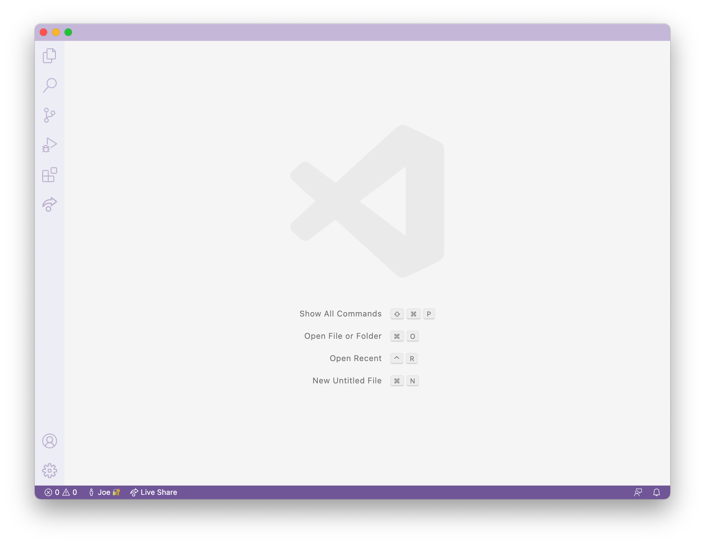
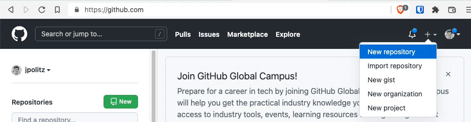
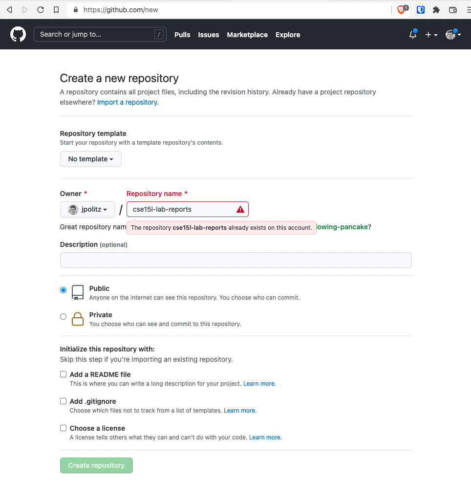
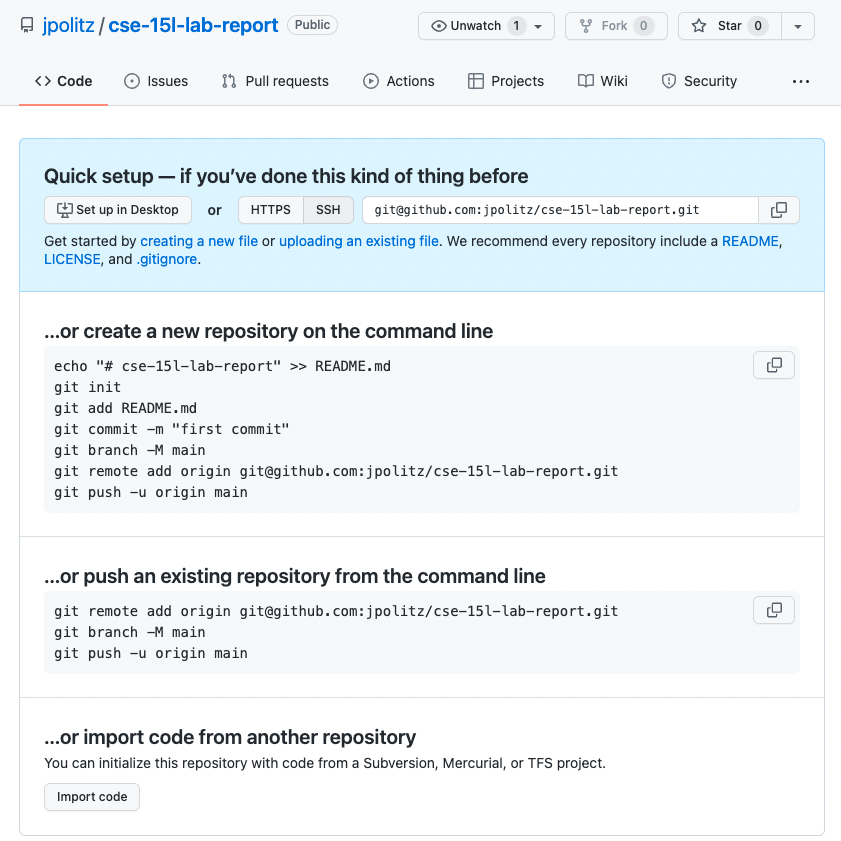
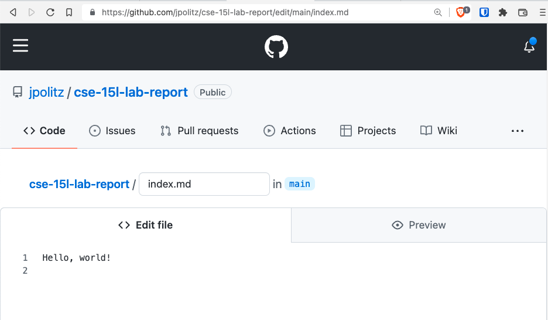
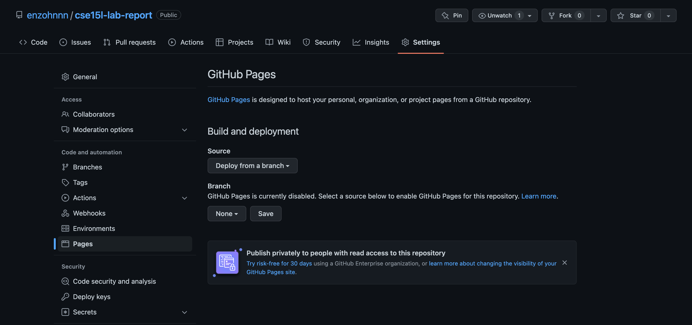
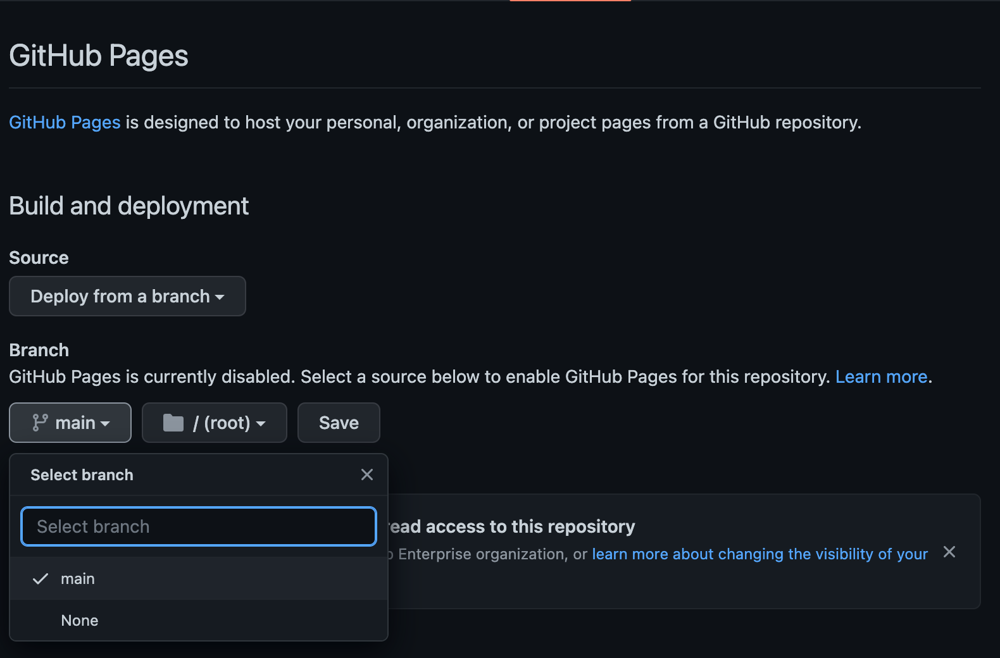
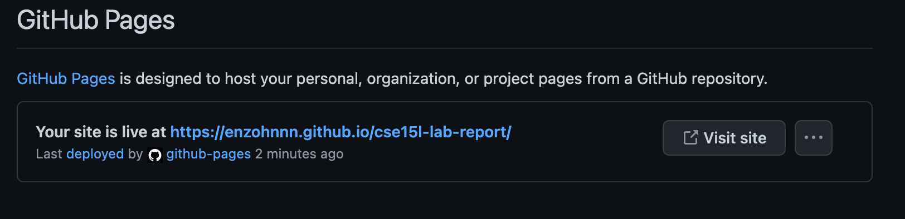
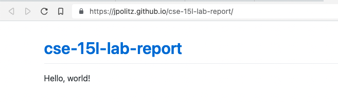

# Lab Week 1 - Markdown, URLs, Paths, & the Filesystem

In this lab you’ll make a professional website for yourself where you can post your lab reports for the course. Please contact the instructor (`jpolitz@eng.ucsd.edu`) if for personal privacy or security reasons you do not want to publish a public website, even under a pseudonym.

## Part 1 - Meet Your Group

We will split into groups of 6-8 students for discussion. For week 1, you may sit wherever you want and choose who you want to work with. Starting week 2, we will have assigned seating and groups. These groups will be somewhat stable throughout the quarter, though some small changes will likely happen. You will have a tutor or TA assigned to your group for help and discussion.

Your discussion leader (the tutor/TA in your lab) will share a Google Doc with your group where you can fill in notes as you work; this document is only for your group. Your discussion leader will *not* take notes for you. You can have someone volunteer to take notes or come up with a way to share the role.

**Write Down in Notes**: In your groups, share, and note in the running notes document (discussion leaders, you answer these as well!):

- How you’d like people to refer to you (pronounce your name/nickname, pronouns like he/her/they, etc)
- Your major
- One of:
  - A UCSD student organization you’re a member of or interested in
  - Your favorite place you’ve found on campus so far
  - A useful campus shortcut or trick you know
- Your answer to the following question. Discuss why you chose that answer.

## Part 2 - Your CSE15L Account

Look up your course-specific account for CSE15L [here](https://sdacs.ucsd.edu/~icc/index.php)

For help on resetting your password, here is a [tutorial](assets/How%20to%20Reset%20Your%20CSE15L%20Password.pdf)

Follow the onscreen instructions very carefully! Have someone watch you do it if you feel like it isn’t working.

If you’ve reset and you’re waiting a few minutes for it to take effect, feel free to start working on later sections of the lab,

## Part 3 - Visual Studio Code

(If you can’t or don’t want to use your own computer for this for any reason, you can skip the installation step and just open VScode on one of the computers in the lab! You can do all your work on the lab computers all quarter, no personal laptop setup required.)

Go to the [Visual Studio Code website](https://code.visualstudio.com/), and follow the instructions to download and install it on your computer. There are versions for all the major operating systems, like macOS (for Macs) and Windows (for PCs).

When it is installed, you should be able to open a window that looks like this (it might have different colors, or a different menu bar, depending on your system and settings):



**Write down in notes**: Everyone should share a screenshot of VScode open – help folks figure it out if it won’t install. If someone gets stuck, take a screenshot of the error message or point at which they are stuck so we can help them figure it out later, and they can decide to keep trying (potentially with the tutor helping) or move on.

## Part 4 - Remotely Connecting

**In Your Group for 15 minutes**

**Note**: In this section, whenever you see a chunk of code in light gray, we are specifying that the code block is running on the **remote** server (in this case there will just be a comment at the beginning when it should be on remote). For example:

```shell
  # remote
  $ this is a command to the remote server
```

```shell
  $ this is a command on your own computer
```

Many courses in CSE use course-specific accounts. These are similar to accounts you might get on other systems at other institutions (or a future job). We’ll see how to use VScode/terminal to connect to a remote computer over the Internet to do work there.

There is a first step you need if you’re on Windows: install `git` for Windows, which comes with some useful tools we need:

[Git for Windows](https://gitforwindows.org/)

Once installed, use the steps in this post to set your default terminal to use the newly-installed `git bash` in Visual Studio Code:

[Using Bash on Windows in VScode](https://stackoverflow.com/a/50527994)

Then, to use `ssh`, open a terminal in VScode. (Ctrl or Command + \`, or use the Terminal → New Terminal menu option). Your command will look like this, but with the `zz` replaced by the letters in your course-specific account.

```shell
$ ssh cs15lsp23zz@ieng6.ucsd.edu
```

(That’s one, five, l (lowercase letter L, not one); the one and l look very close in some fonts. And remember that when we write the `$`, that’s not for you to type in! It’s just a convention for how we write commands.)

Since this is likely the first time you’ve connected to this server, you will probably get a message like this:

```shell
⤇ ssh cs15lsp23zz@ieng6.ucsd.edu
The authenticity of host 'ieng6.ucsd.edu (128.54.70.227)' can't be established.
RSA key fingerprint is SHA256:ksruYwhnYH+sySHnHAtLUHngrPEyZTDl/1x99wUQcec.
Are you sure you want to continue connecting (yes/no/[fingerprint])?
```

I (Joe) always say yes to these messages when I’m connecting to a new server for the first time; it’s expected to get this message in that case. If you get this message when you’re connecting to a server you connect to *often*, it could mean someone is trying to listen in on or control the connection. This answer is a decent description of what’s going on: [Ben Voigt’s answer](https://superuser.com/questions/421074/ssh-the-authenticity-of-host-host-cant-be-established/421084#421084)

So type `yes` and press enter, then give your password; the whole interaction should look something like this once you give your password and are logged in:

```shell
# On your client
⤇ ssh cs15lsp23zz@ieng6.ucsd.edu
The authenticity of host 'ieng6-202.ucsd.edu (128.54.70.227)' can't be established.
RSA key fingerprint is SHA256:ksruYwhnYH+sySHnHAtLUHngrPEyZTDl/1x99wUQcec.
Are you sure you want to continue connecting (yes/no/[fingerprint])?
Password:
```

```shell
# Now on remote server
Last login: Sun Jan  2 14:03:05 2022 from 107-217-10-235.lightspeed.sndgca.sbcglobal.net
quota: No filesystem specified.
Hello cs15lsp23zz, you are currently logged into ieng6-203.ucsd.edu

You are using 0% CPU on this system

Cluster Status
Hostname     Time    #Users  Load  Averages
ieng6-201   23:25:01   0  0.08,  0.17,  0.11
ieng6-202   23:25:01   1  0.09,  0.15,  0.11
ieng6-203   23:25:01   1  0.08,  0.15,  0.11

Sun Jan 02, 2022 11:28pm - Prepping cs15lsp23
```

Now your terminal is connected to a computer in the CSE basement, and any commands you run will run on that computer! We call your computer the *client* and the computer in the basement the *server* based on how you are connected.

If, in this process, you run into errors and can’t figure out how to proceed, ask! When you ask, take a screenshot of your problem and add it to your group’s running notes document, then describe what the fix was. If you don’t know how to take a screenshot, ask!

Remember – it is **rare** for a tutorial to work perfectly. We often have to stop, think, guess, Google search, ask someone, etc. in order to get things to work the way the tutorial says. I look up the right way to describe the `(yes/no)` answer on first login all the time, for example. So you are helping your group *learn about potential issues* when you do this, and that’s a major learning outcome of the course! If you see someone else have an issue that you didn’t, ask why, and what might be different about what you did, or how your environment is set up. You will learn by reflecting on this.

**Write down in notes**: When you’re done, **discuss** what you saw upon login. Take a screenshot or copy/paste the output. Did you all see the same thing? What might the differences mean? Note the results of your discussion in the notes document.

## Part 5 - Run Some Commands

Try running the commands `cd`, `ls`, `pwd`, `mkdir`, and `cp` a few times in different ways, both on **your computer**, and on the **remote computer** after ssh-ing (use the terminal in VScode) . Discuss in your group what you see. Can you cause them to produce error messages? What do they mean? If you’re on Windows, what happens when you use them on Windows?

Here are some specific useful commands to try:

- `cd ~`
- `cd`
- `ls -lat`
- `ls -a`
- `ls <directory>` where `<directory>` is `/home/linux/ieng6/cs15lsp23/cs15lsp23abc`, where the `abc` is one of the other group members’ username
- `cp /home/linux/ieng6/cs15lsp23/public/hello.txt ~/`
- `cat /home/linux/ieng6/cs15lsp23/public/hello.txt`

**Write down in notes**: Copy at least one example from each group member, with an explanation, into your shared notes doc.

Hint: To log out of the remote server in your terminal, you can use:

- Ctrl-D
- Run the command `exit`

You can also open more terminals in VSCode (there is a little + button at the top of the terminal window where you can create another).

## Part 6 - Git, Github, and Github Pages

Having a professional portfolio website for yourself can be useful in many, many ways. It’s a useful URL to put at the top of your resume/CV where potential employers can learn more about you. Lots of great work in CS is published only on someone’s personal page, or is at least most accessible there. Most CS faculty have such a page ([just](https://roseyu.com/) [a few](https://cseweb.ucsd.edu/~tzli/) [examples](http://kvaccaro.com/) [from new](https://web.engr.oregonstate.edu/~jensenca/OSU_ENGR/index.html) CSE faculty), for example.

Also, journaling and logging what you’ve learned is a powerful tool. Writing down what we’ve done and how we’ve done it, for an audience (real or imagined) other than ourselves, forces us to confront lingering misconceptions and cements what we learned in our memories. It’s also simply useful to refresh your memory later!

For these reasons, we’ll spend the rest of this lab creating a personal page, and then learning to write a blog post about what we learned.

[Github](https://www.github.com) is a web service for storing and sharing code, along with a huge number of services surrounding that code. It uses a tool and protocol called `git` [https://git-scm.com/](https://git-scm.com/) to store and retrieve that code. [Github Pages](https://pages.github.com/) is one of the services Github provides for publishing personal and project websites from your Github account.

This lab is a basic introduction to all of these. We will learn to use them in more detail as the quarter goes on; learning all that git, Github, or Github Pages has to offer could take months of practice!

## Part 7 - Creating a Website with Github Pages

This section will show you how to create a site with Github Pages that you’ll use for your lab reports.

There are written instructions with screenshots below you can follow, and also a video version:


### Make a Github Account

Go to [https://www.github.com](https://www.github.com/) and create an account:


(If you already have an account, you choose if you want to use it or create a new one for this course).

You can choose any username you like for the account; it doesn’t have to be related to your legal or preferred name, though it can be and often is. Some people choose names related to their name, like me (my Github account is [jpolitz](https://github.com/jpolitz)). Others choose more abstract or whimsical names for their accounts, just like usernames on any other service. Feel free to do whatever feels right to you, and in any event, you can always [change it later](https://docs.github.com/en/account-and-profile/setting-up-and-managing-your-github-user-account/managing-user-account-settings/changing-your-github-username).

### Create a Repository

Once you’ve created your account, we are going to *create a new repository* on Github. A *repository* is a folder or directory with an associated history of changes that were made to the files within it. In this sense, a repository on Github has some similarities to a folder in Google Drive; the differences are mainly in the level of control we get in managing that history of changes.



Name the repository `cse15l-lab-reports` (in my screenshot it looks like the name is taken because I made it before taking the screenshot; it will be green and OK for you). Leave the other settings as they are, and click “Create Repository” at the bottom.



You should see a screen like this (but with your username):



Click the “Create a new file” link (small, in blue, beneath the “Set up in Desktop” button). Make a new file called `index.md`, and put some text in it (whatever you like).



Scroll down to the bottom of the page and click “Commit new file”. You should see a view of your repository that now lists a file called `index.md`.

You have a public Github repository with some text in it! You can copy the link from your browser and send it to your friends and family to view!

### Making a Pages Site

Next, click on “Settings” at the top of your repository, and then choose the “Pages” option in the sidebar:





Choose `main` as the source for Github Pages, and click “Save”.



At the top it’ll say “GitHub Pages source saved”. Wait a bit and refresh the page. Eventually you’ll see a message that says “Your site is live at `<url here>`.” (This can take a few minutes!) Click the link that’s shown there; at first it will say the page isn’t found. Wait a few minutes, then refresh the page. Then you should see the text you wrote show up on a page like this:



Note that in addition to seeing your file at, e.g, [https://jpolitz.github.io/cse-15l-lab-report/](https://jpolitz.github.io/cse-15l-lab-report/), you can also see it with `index.html` added to the end of the URL: [https://jpolitz.github.io/cse-15l-lab-report/index.html](https://jpolitz.github.io/cse-15l-lab-report/index.html) (Try it!).

**Do now!** Add another file to your repository with any name you choose, but end it in the extension `.md`. Can you use this idea to see that file?

### Editing Markdown

The `.md` extension stands for “Markdown,” which is a particular text format used for writing. There are many good documents on the web. A good cheat sheet and explainer are here:

- [Cheat sheet](https://commonmark.org/help/)
- [What is Markdown?](https://www.markdownguide.org/getting-started/)

Skim both of those documents, then try to use some of the elements described in the cheat sheet in your `index.md` file. How do some of the different formatting options show up when you use them? Are any surprising?

You should now have:

- A repository with at least two files (`index.md` and another one you made up)
- In one of those files, a use of each kind of basic Markdown syntax
- A page that shows the rendered version of your Markdown text at a public URL

**Congratulations** – you now know how to make a (simple), public-facing website with basic formatting! You can share the link to your page with anyone in the world with an internet connection, and they can see your page.

(Fun fact: [the page you are reading](https://github.com/ucsd-cse15l-s23/ucsd-cse15l-s23.github.io/blob/main/_posts/weeks/2023-01-09-week1.md) is written in Markdown and uses Github Pages!)

### Before You Leave

Please go ahead and fill out this Google form before you leave, this will help us create the seating chart for next week. [Link to Google form](https://forms.gle/RBCZE823NnWVEGGo6)
